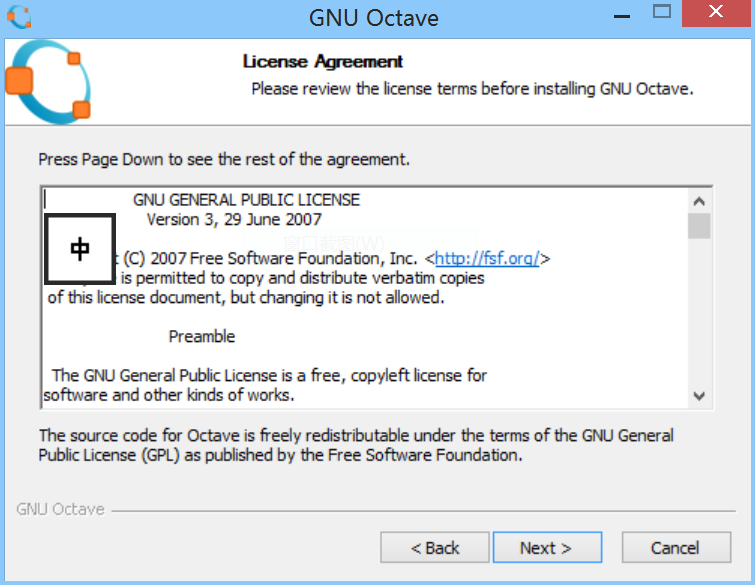
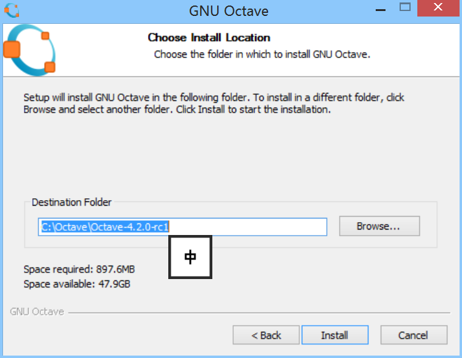

本章将会带领你进入GNU Octave语言。我们会简要地讨论什么是GNU Octave以及它的优缺点。你也会看到GNU Octave的实际操作。但在这之前，你需要将软件安装至电脑上，我们会快速介绍一下安装过程。

特别地，本章中你将会：

 - 获得对GNU Octave语言的快速介绍。
 - 学会如何在Windows和GNU/Linux环境下安装软件。
 - 在GNU Octave中输入几个命令，来看它是如何运作的。
 - 定制化GNU Octave软件。
 - 安装附加软件包。
 - 学会一些交换的技巧。

虽然GNU Octave软件也有Mac/OSX，Solaris和OS/2操作系统的版本，我们将自己局限于Windows和GNU/Linux操作系统上的安装步骤。我们强烈建议你安装最新版本的GNU Octave（3.2.4版，甚至更高的版本）。

本书中描述的一些特性在版本2中不予支持，特别是绘图，在最新的版本中得到了明显改进。

**何为GNU Octave？**

简单地说，GNU Octave为一款成熟的数值分析多功能软件工具。GNU Octave提供了以下内容：

1. 可用于解决许多不同问题的大规模内置函数；
1. 用于扩展GNU Octave的完整编程语言；
1. 绘图工具；

本书的介绍将会覆盖这些特性。

GNU Octave在运行期（run-time）使用解释器来编译和运行一系列用户给出的指令。这也是PHP和Python等语言的工作方式。与诸如C的编译式语言不同，程序首先被编译，其次手动执行。与Python一样，你可以在命令提示的环境下输入指令。后面我们会看到许多这样的例子。下面的截图中显示了GNU Octave实际运行中的情景。初次看到，不用纠结于绘图中的内容。

GNU Octave的命名来自于化学家Octave Levenpiel，与音乐中条谐波无关。项目由James B. Rawling和John J. Erkert发起。却主要由John W. Eaton开发,他在该项目中投入了巨大精力。GNU Octave是GNU官方项目。因此，名称前冠以GNU的字母。源代码以GPL授权发布。

简而言之，这意味着你可以将软件用于任何目的，可以复制和发布该软件，对软件作出任何变动。你可以在GPL版权下发布新软件。如果你是用GNU Octave语言扩展而来。你就可以选择任何其他授权方式。我推荐你去读一下GNU Octave附带的协议文件，见http：//www.gnu.org/software/octave/license.html。

本书后面部分，我们出于方便，仅用Octave指称GNU Octave。你如果要显摆一下自己像个Octave 大咖，请冠以GNU。

**用途**

如前言所述，Octave可以用来解决许多不同的科学问题。举例来说，一家位于Copenhagen的商业软件和咨询公司专门解决优化问题，尤其是对如何于大型货轮上安装集装箱的问题。这可以模拟成线性编程问题，涉及解决大型线性方程系统。该公司使用Octave来解决。Pittsburg超算中心也使用Octave来研究社会福利的脆弱性问题。该中心里，Octave运行于一个名为Pople的大型并行计算机上，该计算机拥有768块内核和1.5TB的内存。采用新方案前，研究人员可以采用不同的策略进行复杂的分析。

Octave也被学术界用来进行数据分析，图像处理，经济计量学，高级统计分析等等。我们将会在书中见到大量此类的例子。

**Octave的缺陷**

Octave主要设计成用于进行数值计算，而不是跟C和C\++一样的通用性编程语言。因此，你应当根据需要解决的问题来选择编程语言。然而，Octave也会在许多功能上对你有所帮助，比如文件读写，也可以使用socket软件包来直接访问网络。

Octave使用解释器的事实，意味着Octave将指令转换成机器可以读取的代码之后运行。这种方式有利有弊。主要的好处是指令易于实现和变更，而不用通过编辑、编译和运行期的方式，给予程序者或者用户更高程度的控制权。主要的缺点是与诸如C、fortran之类预编译型程序比较，运行速度较慢。如果你想模拟大规模并行运算，诸如天气预报，Octave就不是你的首选。

但是，正如你将会在本书后面遇到的，Octave也可以让你具备解决非常高级和计算密集型问题，只需要一些指令或者命令就可以得到满意的速度。最后一章会交给你一些优化技巧以及如何使用C++在一些场景下来大幅加速Octave。

Octave未被设计成用于分析（符号）数学。如果你想得到一个函数，譬如$f(x)=x^2$的导数，Octave就不是一个好的选择。这些方面，诸如Maxima和Sage的软件包可能是有帮助的。值得一提的是，Octave中也存在软件包（软件包通常也被称为工具包），可以做一些基本的分析数学。

**Octave与MATLAB**

是时候提一下MATLAB了，Octave通常被称为MATLAB-clone（MATLAB是MathWORK公司出品的产品）。个人观点认为这是错误的！不如说，Octave寻求与MATLAB兼容。需要注意的是，一些场合下，你不能简单地在MATLAB上运行Octave程序，反之亦然。整本书里，会指出何处会出现兼容性问题。但是，我会坚持使用Octave。而不是刻意来兼容MATLAB。

**Octave社区**

最新发布的Octave版本可以在网页http://www.octave.org上找到。该网页上你也可以找到官方手册和充满各种技巧的Wiki，最近的新闻，一些史料和其他令人兴奋的内容。读者可以从该页面加入Octave邮件列表（help-list特别实用），只需要一个有效的email地址就可以加入。用户社区非常活跃和乐于助人。即使社区开发人员，也会回答用户的“简单”问题。你也可以浏览已归档的旧电子邮件，从而学到不少东西。

Usenet上也有一个讨论小组http://groups.google.com/group/soft-sys.octave/topic?link。不幸的是，该小组看起来不是非常活跃。帮助通常需要好久才会回复。

标准软件包之外，还有各种许多附带的软件包。其中很多可以在Octave-forge http://octave.sourceforge.net上下载。你可以找到用于图像处理，计量经济学，信息理论，分析数学相关的多个软件包。阅读完本书，你就可以编写自己的Octave软件包，甚至可以与其他人分享自己的软件包，整个Octave社区会因你的工作而受益，其他人甚至可以扩展和改进你开始的工作。

**安装Octave**

Octave主要被设计成运行于GNU/Linux环境下，但是读者也可以在Windows下运行。安装过程在Windows环境下很流畅。让我们从它开始。
在Windows下安装Octave非常直接，步骤如下：

1. 去Octave-forge网页，该网页上含有一个超级链接到Windows installer下载。下载该安装软件到你的桌面或者其他地址。
2. 双击installer图标。
3. 读者会看到问候窗口，点击Next按钮。

4. 下个窗口会向读者显示授权协议，建议读者去读一下，然后点击Next按钮。

5. 现在读者可以有机会去选择Octave的安装地址。默认路径通常没有问题，当读者对安装路径没有问题的话，然后点击Next按钮。

6. 下个窗口会向读者选择不同版本的FFTW3和ATLAS数值分析库做出选择。这些库分别被用于傅立叶变换和线性代数计算。不同的版本还用于不同CPU构架。读者也可以选择其他附加软件包。正如下面的截图中所显示的。读者现在不用对FFW3和ATLAS库感到不安。只需要选择通用版本即可。

7. 点击Octave-forge，点击Next按钮。Octave就可以安装好了。

8. 安装好后，读者可以变动菜单。如果你原意的话，读者也可以检查Readme文件。如果不想的话，只需要Next按钮，就大功告成了。
注意：Octave的交互环境会出现，想关闭的话，只需要输入：

        octave:1>   exit

或者同时按下Ctrl和D键。我们将这种组合记作Ctrl+D，顺便说一下：Ctrl+D是Unix系统中文件休止符的提示符。经常作为推出程序的一种快捷键。
其他方式，读者还可以通过Cygwin运行Octave于Windows中。与GNU/Linux环境下Windows环境下。这儿不会仔细研究Cygwin的Windows安装。但是读者可以方便地参考Cygwin网页http://www.Cygwin.com

**GNU/Linux**

在许多GNU/Linux发行版本中，Octave是推荐软件的一部分。因此，在安装Octave之前，检查一下该软件是否已经安装于读者的电脑上。如何做，打开一个终端。在终端shell下输入下面的指令：

        $ Octave

如果Octave已经确定正确安装，读者在命令行下可以看到Octave命令。现在可以输入下面的命令退出。另外，读者也也可以运用Ctrl+D，即同时按住Ctrl+D键。
如果Octave未被安装，读者也可以使用发行版中的软件包管理系统安装。比如，在Ubuntu中，读者可以可以使用Synaptic 软件管理包。该包管理器有图形界面来安装和删除电脑上的软件。读者可以参考下面的截图。至于Fedora和CentOs，读者可以采用YUM。
![enter image description here][2]

**GNU/Linux环境下，从源码构建OCtave**

如果读者愿意的话，也可以直接从源代码构建Octave。但是我只能推荐。只有Octave在系统的软件包中不能提供时。这样做，为了编译Octave。读者需要方面的工具：

 - GNU make工具
 - Fortran和C/C++编译器（GCC，版本4.1或者更高）
 - GnuPlot

幸运的是，这些软件包通常存在于大部分GNU/Linux发行版本中。如果没有的话，读者也可以从软件包管理器中加以安装。

**实战时刻--从源代码运行Octave**

 1. 从http://www.gnu.org下载最新的Octave版本并保存到任何目录下。该文件是一个压缩文件，使用.tar.gz作为压缩扩展名。
 2. 打开终端，进入已下载源码文件目录。输入下面的命令解压缩文件：

        $ tar zxf octave-version.tar.gz

 3. 这里version指的是版本号。该命令会创建名为octave-version的目录。

 4. 输入以下命令进入该目录：

        $ cd octave-version

 5. 现在我们可以输入下面的命令对构建和编译过程进行配置：

        $ ./configure

 6. 如果配置过程没有问题，我们就可以输入下面的命令编译Octave源代码（需要一段时间）：

        $ make

 7. 在实际安装之前，读者可以测试一下构建过程是否正确。为如此目的，输入下面的命令：

        $ make check

 8. 其中一些测试会失败。但是，这并不是意味着构建过程是不成功的。测试不是强制的。

 9. 为了安装Octave到电脑上，读者必须有root权限。比如说，读者可以输入下面的命令：

        $ sudo make install

 10. 现在输入root密码。好了，大功告成。

发生了什么事？

正如读者看到的，我们只是进行了标准的Unix安装步骤：configure，make，make install。如果读者没有root权限，就不能将Octave安装于电脑上。但是，读者仍然可以将Octave安装于bin/的子目录下面。

再次，前面的安装过程只会安装OCtave，而不是做图程序。读者需要单独为Octave安装做图程序。

**使用Peaks检查你的安装**

是时候用Octave来！有很多不同的方法启动Octave的解释器。其中方法之一就是执行Octave脚本，另一个方法是在Octave的交互环境中输入，这正是我们现在使用的方式。

**实战练习-用peaks检查**

1. 读者可以输入octave进入交互环境或者在Windows中双击Octave图标。现在读者可以看到prompt：

    octave:1>

2. 读者已经学过如何退出交互环境。只需要在Octave中输入exit或者按下Ctrl+D，但是我们现在不打算退出。

3. 在中，输入如下命令：

    octave:1> surf（peaks）

4. 现在读者可以看到一个3维surface图，正如下图中左边的所示图片。如果不是的话，说明读者的安装没有成功，将你的鼠标箭头指向窗口，摁住鼠标往下拉，移动箭头。如果做图程序支持的话，图画会按照你指的方向转动。如果读者，可以通过。

5. 让我们试一下截面图。输入下面命令：

    octave:2> contour(peaks)

 6. 出现的图会像右边的图一样？如果不是的话，可能是因为读者使用了3.2.4版本而安装了oct2mat软件包。尝试着输入：

        octava:3> pkg unload oct2mat

 7. 现在重新输入上面的命令

 8. 点击窗口右边图中

**刚才发生了什么？**

左边的图显示了一个数学函数的图，该函数为：
$$
f(x,y)=3(1-x)^2\exp(-x^2-(y+1)^2)-10(\frac{x}{5}-x^3-x^5) \exp(-x^2-y^2)
$$

该函数的值域通过octave中的命令peaks进行求值，改名字是函数f的别名。图形就可以用octave中的命令surf来画。默认的情况下，Octave计算函数f使用50 个在【-3:3]x和y的值。正如读者可能已经猜到的样，contour  Octave函数会画出函数f的截面。在后面的内容里，我们会学习如何标注坐标轴，在图中加入注释，甚至更多。

**定制Octave**

当Octave解释器启动时，它会读取几个配置文件。这些文件是可以改动的，可以加入系统的路径，Octave命令启动，编辑器的行为，甚至更多。这些变动可以是全局的，也可以是运行在计算机上的所有用户。这些变动也可以是针对某个特别版本Octave，某个特别项目或者某个特别用户。这些对于多用户平台特别有用，比如GNU/Linux。

配置文件名称为octaverc或者.octaverc，取决于该文件的位置和配置如何影响Octave。它们基本上是由一系列Octave命令组成，因此，读者也可以从Octave prompt中输入相同的命令。这个方法在octaverc或者.octaverc中运行之前可以用于测试新的配置。

文件名octaverc或者.octaverc当然不会被MATLAB支持。但是，这些命令却是MATLAB支持的。因此，复制Octave配置文件中的这些命令至matlab.m中就可以直接使用。

在Windows环境下，用户没有对应的主目录，跟GNU/Linux中的主目录一样。因此，我建议读者可以为Octave创建一个主目录。读者的命令Octave就可以进入这个目录，在这里寻找你的配置文件，无论何时读者启动解释器。

如果读者正在使用GNU/Linux，读者就可以接下来的“Time for action ”部分。

**实战时刻-在Window环境下创建主目录**

让我们假定Octave主目录为C：\Documents and Settings\GNU Octave\。我们可以实际上从Octave中直接创建；因此，让我们继续。

1. 启动Octave，输入下面命令：

    octave:1> cd C:
    octave:2> cd "Documents and settings"
    octave:3> mkdir "GNU Octave"
        ans= 1

2. 响应ans=1出现命令行之后，意味着目录已经成功创建。如果Octave返回令值，表明出现了一些错误，而且Octave也会打印出一条错误信息。除了通过Octave来创建目录以外，读者也可以在Windows管理器中创建。

3. 我们还需要告诉解释器现在是在Octave主目录。我们可以在OCtave中这样做：

    octave:4>  edit

4. 现在读者可以看到一个编辑器弹出。在Windows下的默认编辑器是Notepad++。打开文件c:\octave-home\share\octave\ site\m\startup\octaverc，其中octave-home指的是Octave的安装路径，比如Octave\3.2.4_gcc-4.4.0。在该文件中的末尾加入下面这一行：setenv('HOME','C:\Document and Settings\GNU Octave\');cd ~/

    确认没有输入错误！

5. 保存文件，退出编辑器，重启Octave，一切大功告成。

**刚才发生了什么？**

前3个Octave命令应该很清楚：我们切换目录至C：\Documents and Settings \ ,然后创建GNU Octave。 在这之后，我们大可全局配置文件，加入了两条命令。下次，Octave启动的时候，它就会执行这两条命令。第一条命令告诉解释器将主目录设定为C：\Documents and Settings \GNU Octave，第二条命令进入该目录。

**创建你的第一个.octaverc文件**

学会了在Windows下创建主目录后，我们就可以定制Octave于GNU/Linux环境下，与Windows环境下一样。

**是战时刻-编辑.octaverc文件**

1. 如果读者还没有启动Octave的话，现在启动Octave，然后打开默认编辑器：

        octave: 1 > edit

2. 将下面的几行命令复制至文件里，将文件保存成.octaverc到Octave的主目录。如果是Windows的话，在用户目录下，GNU/Linux。或者，用读者自己最喜爱的编辑器来创建这个文件：

        PS（">>   ")
        edit mode "async"

退出编辑器，重启Octave。

**更多关于.octaverc的内容**

默认编辑器可以在.octaverc文件中。这可以通过在你的文件里加入下面的这一句：

        edit editor name of the editor

这里name of the editor就是读者的编辑器。读者使用Windows中的话，可以选择notepad，在GNU/Linux中为gedit。再一次，在加入.octaverc文件，读者需要测试一下编辑器是否可以在Octave中调用。

后面的章节里，我们会脚本和函数文件。Octave将会不得不来指定何处可以找到这些文件来阅读他们。Octave使用一直路径结构来收缩文件，学会如何告诉Octave来寻找这些文件是非常重要的。我推荐读者在主目录中创建一个新的文件夹，将名字命名成Octave。读者就可以将自己的Octave文件放置于该文件夹中，让解释器自己来寻找它们。

让我们首先创建文件夹。这个很简单，只要进入Octave，然后输入下面的命令：

        octave:1> cd ~/
        octave:2> mkdir octave

显而易见，这些命令是干什么的。现在，输入这些：

        octave:3> edit .octaverc

将下面这一行加入至文件中：

        addpath("~/octave/")

保存这个文件，退出编辑器，重启Octave，或者使用source（”.octaverc")。在Octave的行中，输入下面的命令：

        octave:1> path

现在读者可以看到~/octave/已经被加入至搜索路径中了。在Windows下面，该路径为所有用户使用。路径列表很长，因此读者需要。当读者到达最后的时候，读者可以点击Q键来退出。

**安装附加软件包**

正如前面提及的，Octave有大量的附加软件包，其中许多软件包可以从Octave-forge上下载，让我们试着来安装msh软件包，该软件包被用于为偏微分方程创建mesh。

**实战时刻--安装附加软件包**

 1. 在安装新的软件包之前，读者需要检查一下该软件包是否已经存在，以及他们的软件版本号。如果读者还没有的话，可以使用下面的命令：

        octave:1> pkg list

 2. 读者可以看到一张列表，包含软件包名称，版本号，和安装路径。比如：

        Package Name  |  Version | Installation directory
        --------------------+-----------+----------------------
        combinatorics |1.0.6|/octave/package/combinatorics-1.0.6

 3. 如果读者选择将所有的软件包安装至资金的Windows安装，列表会很长。如果msh软件包已经安装，如果已经安装，可以看一下它的版本号。然后，读者就可以按下Q键退出。

 4. 现在可以去Octave-forge网页，找到msh软件包，点击Details（在软件包的右面）。现在读者会看一个窗口，含有软件包的详细描述，正如下面图片中所示的。软件包的版本号是否比现在的要高？（如果不是的话，做下来，放松，然后读下面的文字作为享乐）。软件包描述中也显示msh软件包依赖spline软件包和版本高于3.0.0的Octave。但是，spline软件包也许没有在你的系统上安装。在前面的软件包列表中有没有看到spline软件包？如果没有的话，我们需要在安装msh软件包之前安装spline软件包。回到主软件包列表，将msh和spline软件包都下载至自己的Octave主目录。（顺便带一句，spline软件包是否也有依赖）。下载的文件已经具有.tar.gz扩展名。为了安装该软件包，确认你现在位于自己的Octave主目录中，输入下面命令：

        octave:2> pkg install splines-version-number.tar.gz (如果必要的话）
        octave:3> pkg install msh-version-number.tar.gz

 5. 确定已经将软件包文件下载至Octave主目录。

 6. 检测读者自己的新软件包列表，输入下面命令：

        octave:4> pkg list
        Package Name  |  Version | Installation directory
        --------------------+-----------+--------------------------
        combinatorics   | 1.0.6      | /octave/package/combinatorics-1.0.6
        msh                  |  1.0.1     | /octave/package/msh-1.0.5

 7. 现在读者可以输入下面的命令来获取msh软件包的详细描述：

        octave:5> package describe msh
        ---
        Package name:
          msh
        Version:
          1.0.10
        Short description:
        Create and manage triangular and tetrahedral meshes for Finite Element or Finite Volume PDE solvers. Use a mesh data structure compatible with PDEtool. Rely on gmsh for unstructured mesh generation.
        Status:
        Not loaded

 8. 从状态上看，读者可以看到该软件包没有载入，意味着我们不能使用软件包中所带的功能。为了载入软件包，简单地输入：

        ocave:6> pkg load msh

 9. 读者可以使用pkg describe msh来检查该软件包是否载入。实际上，读者可以写在软件包，使用下面的命令：

        octave:7> pkg unload msh

**刚才发生了什么**

要点都已经作了详细的解释。注意读者需要在安装msh之前安装splines，因为依赖关系。

读者可能会觉得有点奇怪，为了使用软件包，你需要载入软件包。如果在安装的时候加入-auto选项，就可以自动将软件包载入。比如，命令3可以用下面的命令行代替:

        octave:3> pkg installl -auo msh-vestion-number.tar.gz

有些软件包即使没有明确载入，也会自动载入。读者这时候可以用-noauto来强制软件包不予载入。

    octave:3> pkg installl -noauto msh-vestion-number.tar.gz

**卸载软件包**

卸载软件包非常容易：

    octave:8> pkg uninstall msh

注意读者会得到一个错误信息如果试着在卸载msh之前卸载splines，因为msh依赖splines。

**获取帮助**

pkg命令非常灵活，可以和很多选项一起调用。读者可以输入下面的命令来获取所有的选项。

    octave:9> help pkg

pkg的帮助文档非常长。
